# Syrian Meals
Syrian Meals is a site for family-run small business that sells home-made syrian meals in Hamburg, Germany, which will be sought from people who enjoy eating both quite delicious and quite healthy food. Syrian Meals will be useful to those poeple as it markets it meals through this site and its links to the relevant social media, which, in turn, makes it feasible for its customers to order their prized meals by phone or email.

# User stories
1. "Home" page: The image of "Grilled Kubbe", which is a flagship of the Syrian cuisine, will fairly quickly make a customer want to order and try a Syrian meal. In the "About Us" section, the customer will learn how and when to order a meal. The "Testimonials" section further encourages the customer to try one of the meals on the website. At the bottom of the page are the social media links of Syrian Meals, which will help people engage and exchange views about the Syrian meals; the social media links are at hand on all pages of the site.

2. "Meals" page: This page shows images of twelve of the Syrian cuisine gems!

3. "Contact" page: Here gourmets find the address and phone of the small business; they can also utilize a contact form.

# Existing Features
+ Navigation bar
  + The full responsive navigation bar is featured on all three pages and includes links to the Logo, Home page, Meals and Contact page and is identical in each page to allow for easy navigation. 
  + This section will allow the user to easily navigate from page to page across all devices without having to revert back to the previous page via the ‘back’ button.

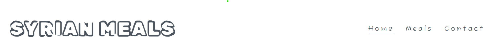
+ The landing page image
  + The landing page image on the top left shows one of the Syrian cuisine trophies "Grilled kubbi" that is so appetizing that a user craves it instantly.
  
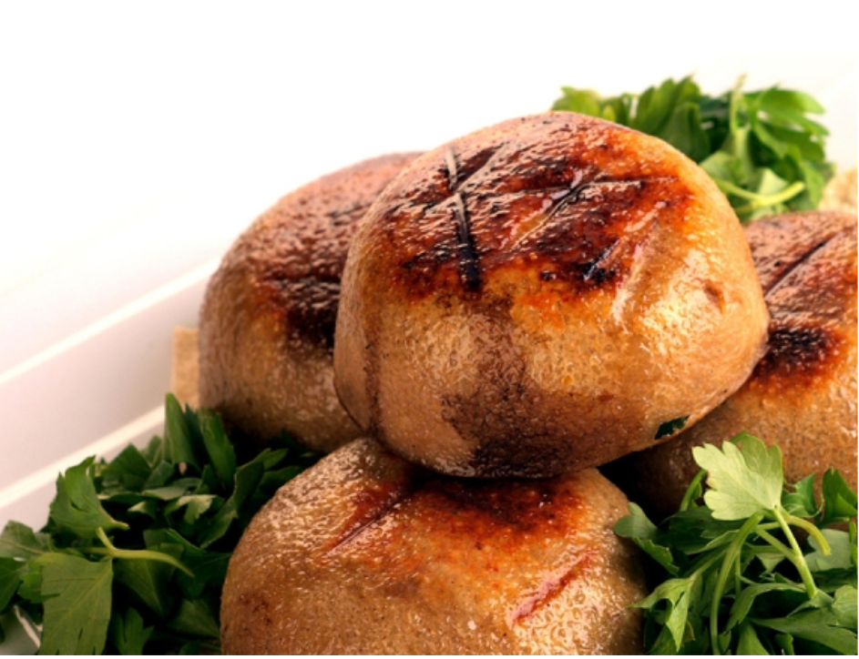

+ "About Us" section
  + This section appears on the top right of the home page and informs a user that "Syrian Meals" is a Syrian, family-run, small business that sells home-cooked, Syrian meals in Hamburg by implementing the Syrian cuisine and using only bio ingredients. Those three characteristics emphasize to a user that this small business aims to produce meals of very high quality that is quite healthy and tasty. The fact that the small business is Syrian demonstrates that the meals not only follow the Syrian cuisine meals, but also are being made by Syrians, whose nutrition system stands the test of time since thousands of years.
  + The second paragraph of explains to a user how he can order a meal; it says that a user can order by phone or email, which are inserted on the contact page, at least one day in advance, which, again, foregrounds that a meal quality is the dominant feature as meals will always be fresh on the day of eating.
  + Furthermore, it has been highlighted that the small business can deliver its meals only in Hamburg.

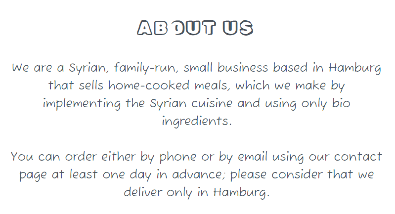

+ "Testimonials" section
  + It reveals three postive testimonials written by customers of "Syrian Meals", which adds to the small business credibility and stimulates a user to buy a meal.

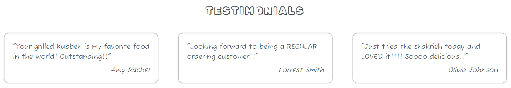

+ The footer
  + The footer section contains links to the relevant social media sites for Syrian Meals. The links will open to a new tab to allow easy navigation for the user.
  + The footer is cherished to the user as it inspires them to keep connected via social media.

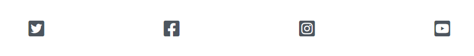

+ The "Meals" section
  + The "Meals" section on the meals pags exhibits 12 captivating images of 12 of the Syrian cuisine sensations, each with the relavent, ancient meal name; at this point a user is expected to order one of the meals as their appetite will be thoroughly activated. The attractive, ancient meals names will arouse a user's curiosity to a greater extent.
  + This includes a small paragraph at the top that describes to a user that each meal is enough for one person, that each meal costs 15 Euros and that delivery costs 5 Euros. Those details helps a user briskly choose which and how many meals they would like.

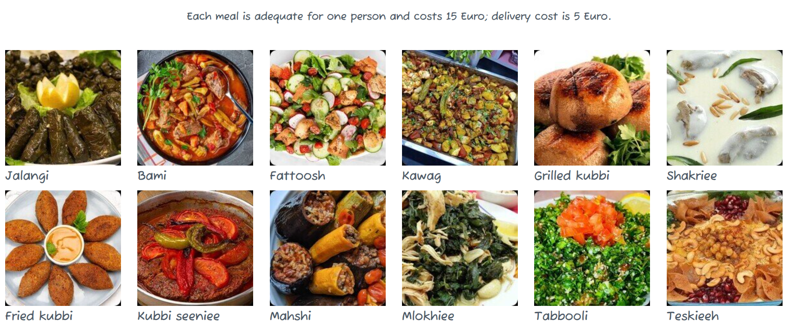

+ The contact form
  + The contact form exists on the contact page and motivates a user to send Syrian Meals a message; in their message they are free to order, to inquire more about the meals or to ask anything they want; a user will be requested to submit their name, phone and email.
  + Underneath the contact form there is an appealing background image that reflects some vegetables and fruits, which allusively accentuates the fact that eating in accordance with a traditional cooking school, like the vintge Syrian one that exclusively employs natural, bio ingredients, is key for anyone who wants to stay strong and healthy.

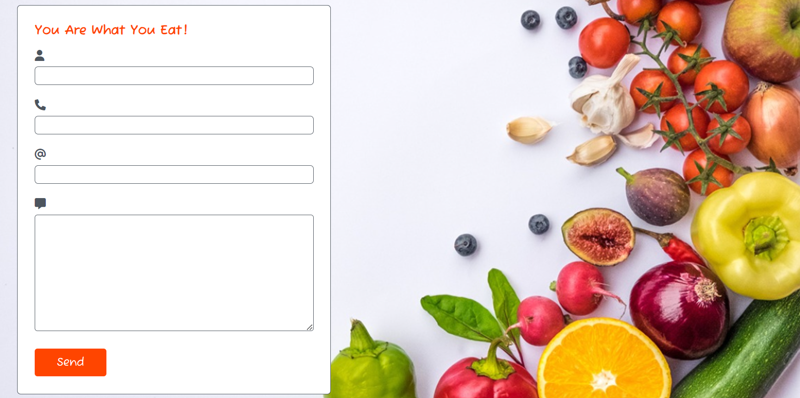

+ Phone and address section
  + The small business phone and address are located here, so a user can contact Syrian Meals and order their meals; the address enables a customer to visit Syrian Meals and fetch their meals themselves, in this case, they will not have to pay the 5 Euros delivery costs.

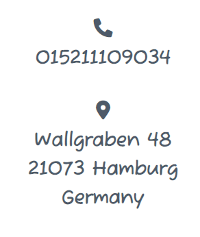

+ Syrian Meals address on Google maps
  + Customers can quickly and precisely locate Syrian Meals as its location on Google maps is embedded just below the phone and address section at the bottom of the contact page.

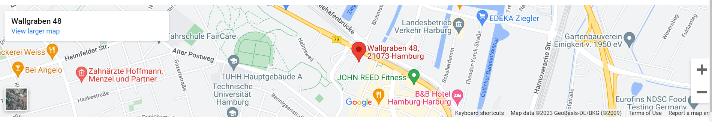

# Future Features
  + In the future, Syrian Meals plans to add more Syrian cuisine wonders to its menu.
  + Customers will be able to order their special meal that will be tailored to meat their individual wishes.
  + An online paying method using, for example, a credit card will be built into the website.

# Typography and color scheme
  + Two Google fonts have been used: "Fuzzy Bubbles" and "Rubik Vinyl".
  + Three colors have been used: rgba(3, 20, 41, 0.7), black and orangered.

# Wireframes
  + There are three wireframes, one for each website page.
  + They are going to be displayed here by means of eight wireframes screenshots as follows.

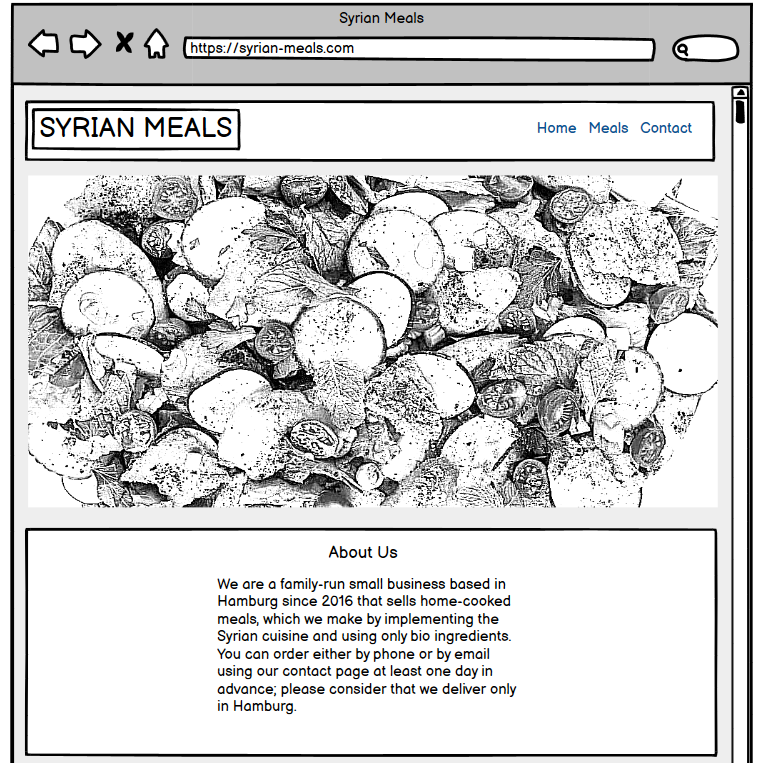

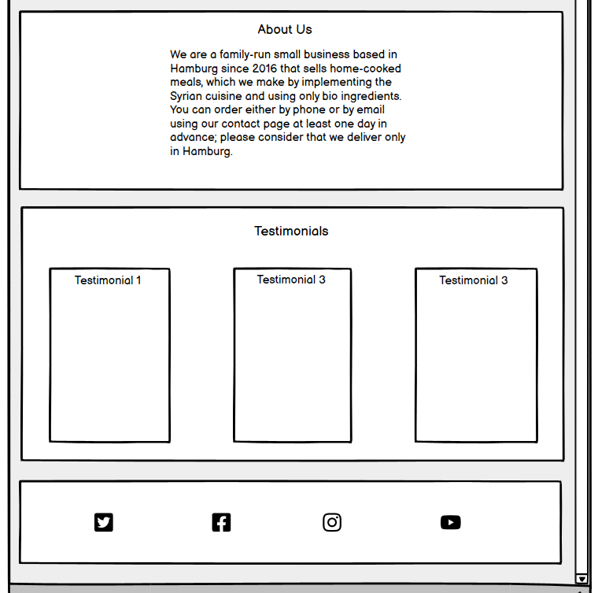

