# Syrian Meals
Syrian Meals is a site for a family-run small business that sells home-made syrian meals in Hamburg, Germany, which will be sought from people who enjoy eating both quite delicious and quite healthy food. Syrian Meals will be useful to those poeple as it markets its meals through this site and its links to the relevant social media, which, in turn, makes it feasible for its customers to order their prized meals by phone or email.

# User stories
1. Home page
   + "As a user, I would like to read, as I am visiting the home page, the main characteristics of the Syrian Meals. If possible, this page should include more info about Syrian Meals reputation."

2. "Meals" page
   + "In this page, I, as a visiting user, want to know which meals are are being sold; images of those meals should be demostrated. Furthermore, Syrian Meals should mention the size and price of each meal. It would be helpful, if the business offers delivery service."

3. Contact page
   + "The contact of Syrian Meals is important to me as a visiting user because I would like to be able to send them a message by means of a contact form inquiring about more details regarding the meals ingredient. Additionally, I expect to find the business phone and address on this page to be able to call them, order and fetch a meal. On top of that, I wish to be able to learn on this page more about the social media, on which this business has pages."

# Existing Features
+ Navigation bar
  + The full responsive navigation bar is featured on all three pages and includes links to the Logo, Home page, Meals and Contact page and is identical in each page to allow for easy navigation. 
  + This section will allow the user to easily navigate from page to page across all devices without having to revert back to the previous page via the ‘back’ button.

+ The landing page image
  + The landing page image on the top left shows one of the Syrian cuisine trophies "Grilled kubbi" that is so appetizing that a user craves it instantly.
  

+ "About Us" section
  + This section appears on the top right of the home page and informs a user that "Syrian Meals" is a Syrian, family-run, small business that sells home-cooked, Syrian meals in Hamburg by implementing the Syrian cuisine and using only bio ingredients. Those three characteristics emphasize to a user that this small business aims to produce meals of very high quality that is quite healthy and tasty. The fact that the small business is Syrian demonstrates that the meals not only follow the Syrian cuisine meals, but also are being made by Syrians, whose nutrition system stands the test of time since thousands of years.
  + The second paragraph of explains to a user how he can order a meal; it says that a user can order by phone or email, which are inserted on the contact page, at least one day in advance, which, again, foregrounds that a meal quality is the dominant feature as meals will always be fresh on the day of eating.
  + Furthermore, it has been highlighted that the small business can deliver its meals only in Hamburg.

+ "Testimonials" section
  + It reveals three postive testimonials written by customers of "Syrian Meals", which adds to the small business credibility and stimulates a user to buy a meal.

+ The footer
  + The footer section contains links to the relevant social media sites for Syrian Meals. The links will open to a new tab to allow easy navigation for the user.
  + The footer is cherished to the user as it inspires them to keep connected via social media.

+ The "Meals" section
  + The "Meals" section on the meals pags exhibits 12 captivating images of 12 of the Syrian cuisine sensations, each with the relavent, ancient meal name; at this point a user is expected to order one of the meals as their appetite will be thoroughly activated. The attractive, ancient meals names will arouse a user's curiosity to a greater extent.
  + This includes a small paragraph at the top that describes to a user that each meal is enough for one person, that each meal costs 15 Euros and that delivery costs 5 Euros. Those details helps a user briskly choose which and how many meals they would like.

+ The contact form
  + The contact form exists on the contact page and motivates a user to send Syrian Meals a message; in their message they are free to order, to inquire more about the meals or to ask anything they want; a user will be requested to submit their name, phone and email.
  + Underneath the contact form there is an appealing background image that reflects some vegetables and fruits, which allusively accentuates the fact that eating in accordance with a traditional cooking school, like the vintge Syrian one that exclusively employs natural, bio ingredients, is key for anyone who wants to stay strong and healthy.

+ Phone and address section
  + The small business phone and address are located here, so a user can contact Syrian Meals and order their meals; the address enables a customer to visit Syrian Meals and fetch their meals themselves, in this case, they will not have to pay the 5 Euros delivery costs.

+ Syrian Meals address on Google maps
  + Customers can quickly and precisely locate Syrian Meals as its location on Google maps is embedded just below the phone and address section at the bottom of the contact page.

# Future Features
  + In the future, Syrian Meals plans to add more Syrian cuisine wonders to its menu.
  + Customers will be able to order their special meal that will be tailored to meat their individual wishes.
  + An online paying method using, for example, a credit card will be built into the website.

# Typography and color scheme
  + Two fonts from Google fonts have been used: "Fuzzy Bubbles" and "Rubik Vinyl".
  + 8 fonts from Font Awesome have been implemented: Facebook, Twitter, Instagram, YouTube, user, phone, email, text.
  + Three colors have been applied: #1f6b23, #ff4500 and #ffffff.

# Wireframes
  + There are three wireframes, one for each website page.
  + They are going to be displayed here by means of eight wireframes screenshots as follows.

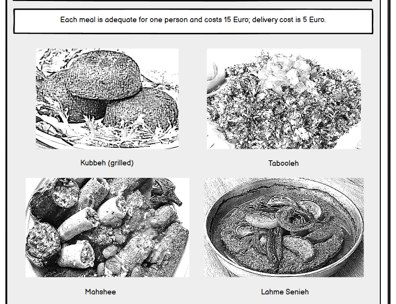

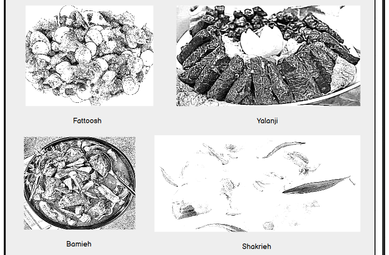

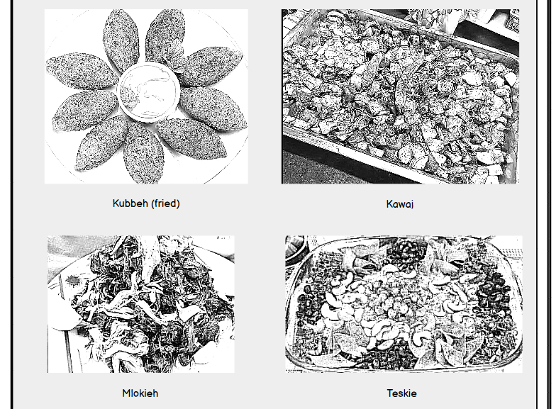

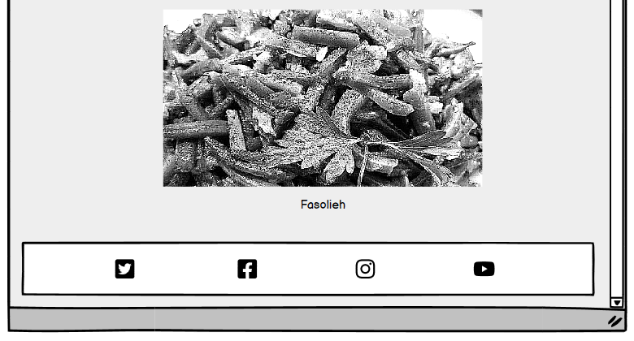

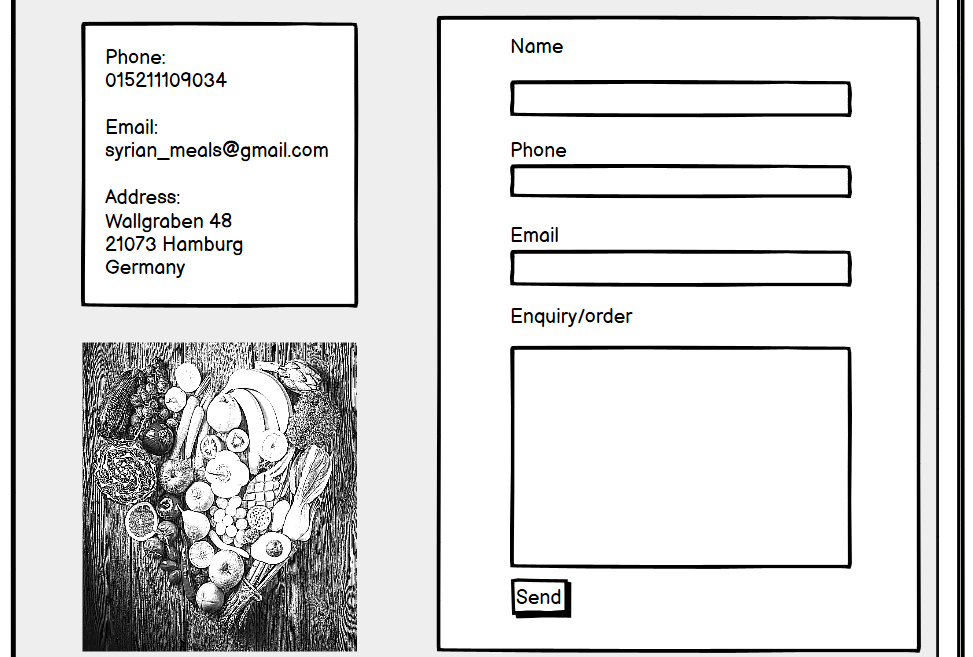

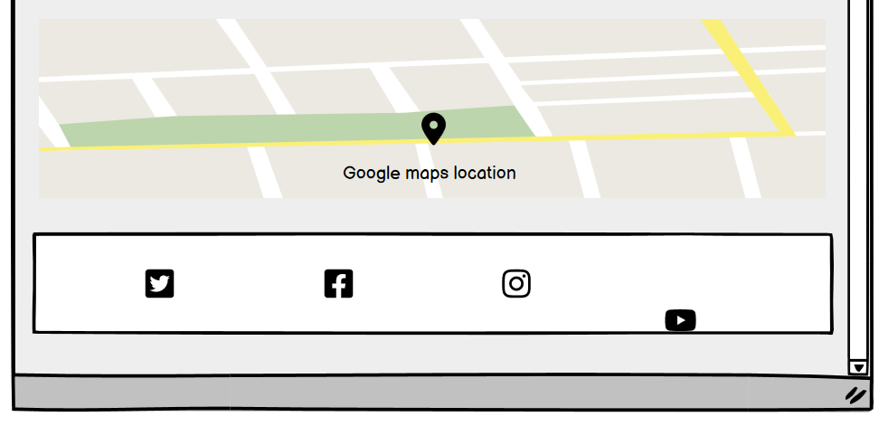

# Technology
  + HTML
    + Using HTML, I created the content of Syrian Meals website, made it accessible, and provided the relevant structure for search engine optimization.
  + CSS 
    + I utilized CSS to make the Syrian Meals website content both visually appealing and responsive on different screen sizes of laptops, tabs and smartphones.
  + Gitpod
    + Gitpod is an efficient cloud-based integrated development environment that I employed to write, review, integrate and deploy the HTML and CSS code of Syrian Meals website without any need for any installations or configurations.
  + Github
    + A platform for version control and collaborative software development, which I made use of to create a central code repository for Syrian Meals website; this, in turn, allows me to keep track of changes made to code and revert to previous versions if needed.
  + Balsamiq
    + This is the program I applied to generate the frameworks of Syrian Meals website.
  + Google Fonts
    + I resorted to Google Fonts to amplify the look of Syrian Meals website, so I integrated two of its fonts into the website by inserting their links in its respective CSS file.
  + Font Awesome
    + To enhance the visual design of Syrian Meals website, I turned to Font Awesome and incorporated 8 fonts into it.

# Code validation
  + index.html page
    + Using the W3C html validator, I checked the index.html page; no errors or warnings were found as the following link demonstrates: [Link to validation of index.html file of Syrian Meals ](https://validator.w3.org/nu/?doc=https%3A%2F%2Fmajdi-aref.github.io%2Fsyrian-meals%2Findex.html&showsource=yes&showoutline=yes)
  + meals.html page
    + Using the W3C html validator, I checked the meals.html page; no errors or warnings were found as the following link demonstrates: [Link to validation of meals.html file of Syrian Meals ](https://validator.w3.org/nu/?doc=https%3A%2F%2Fmajdi-aref.github.io%2Fsyrian-meals%2Fmeals.html&showsource=yes&showoutline=yes)
  + contact.html page
    + Using the W3C html validator, I checked the contact.html page. No errors were found, but three warnings were highlighted. At this point, I prefer to ignore those warnings. Please look at the following link: [Link to validation of contact.html file of Syrian Meals ](https://validator.w3.org/nu/?doc=https%3A%2F%2Fmajdi-aref.github.io%2Fsyrian-meals%2Fcontact.html&showsource=yes&showoutline=yes)
  + style.css file
    + Using the W3C CSS validator, I checked the style.css page. No errors were found; however, one warning was recorded. currently, I would ignore this warning. I could test the style.css file only by direct input, thus I took three screenshots of the css validation result. Please have a look at these screenshots below.

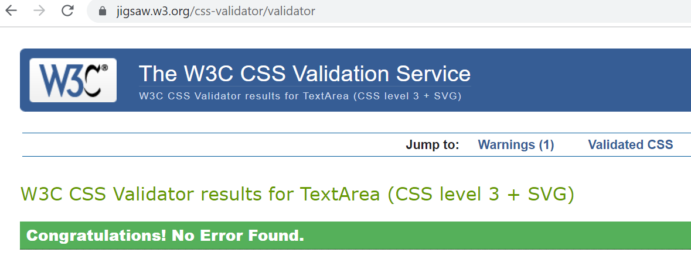

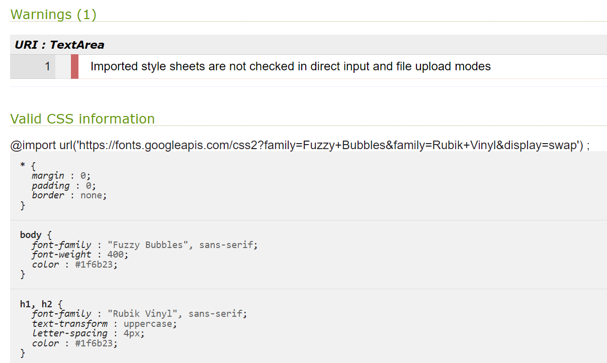

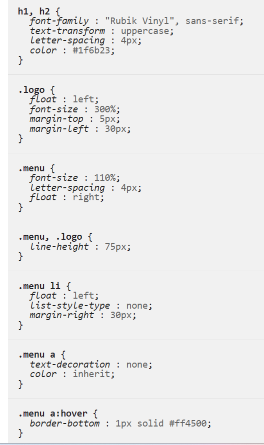

# Test cases (user story based with screenshots)
  + Testing the website header
      + "When I, a visting user of the Syrian Meals website, click on the website logo , it takes me back to the website home page. When I click on any of the three links of the navigation bar, it takes me to the relevant page; for example, when I click on the "Menu" link, it takes me to the menu page."

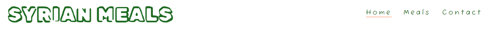

  + Testing the website footer
    + "When I, a visiting user of the Syrian Meals website, click on any of the 4 social media link icons (FaceBook, Twitter, Instagram and YouTube) on any of the 3 website pages, the respective Syrian Meals social media page opens in a new tab. For instance, when I click on the Instagram link icon on any of the website 3 pages, the Syrian Meals Instagram page opens in a new tab."

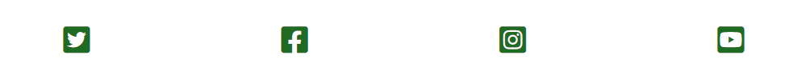

  + Testing the contact form
    + "I, a visiting user of the Syrian Meals website, can make use the contact form on the contact form easily and effectively. I can enter my name, phone number and email in their fitting input fields; I can write a message in the message input field, then when I click on the "Send" button, my message will be successfully sent."

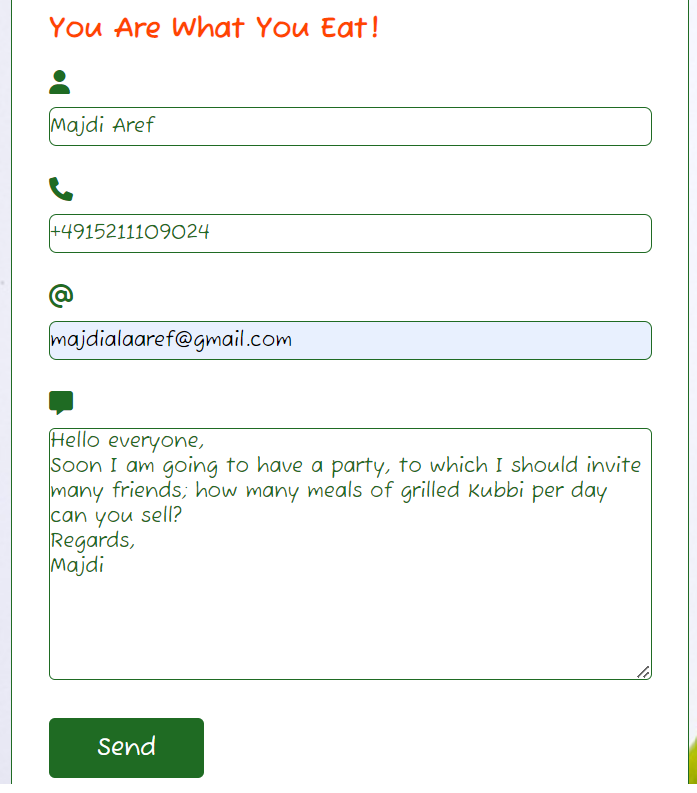

  + Testing Syrian Meals address location on Google maps
    + When I, a visitng user of the Syrian Meals website, click on the Syrian Meals address location on Google maps, a detailed, big Google map opens in a new tab showing me the exact location of Syrian Meals address.

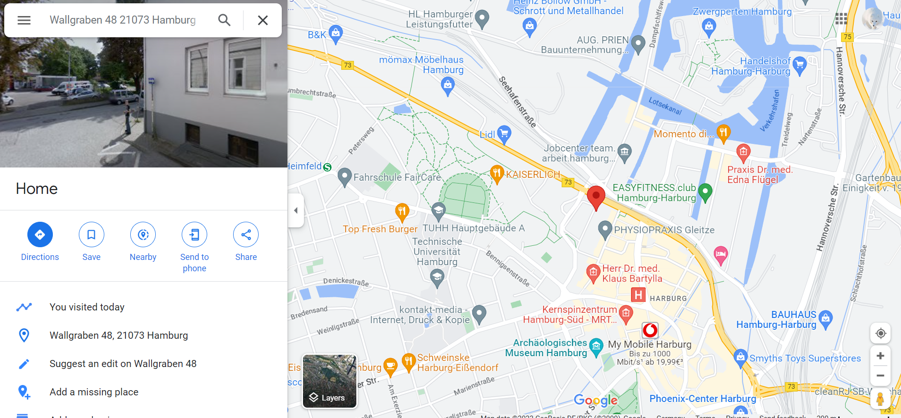

# Fixed bugs
  + There is solely one bug that appears as interrupted underlines underneath Syrian Meals logo; oddly, it appears only on smartphones screen sizes. Until now I can not debug it, nonetheless, I hope I would be able to debug it before I submit my porfolio project 1, Syrian Meals.

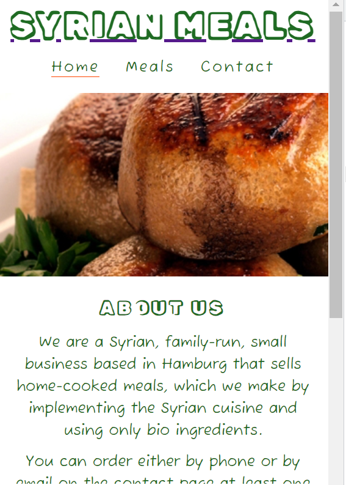

# Supported screens and browsers 
  + I tested the website design of Syrian Meals on all screen sizes (Laptops, tabs and smartphones screens). The browser that I plied the most is Google Chrome; sometimes I exercised Microsoft Edge.
  + Please have a look a the images below; they show how Syrian Meals website pages look on smartphones, tabs and laptops.

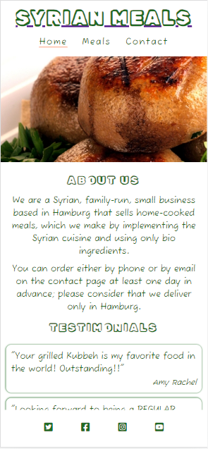

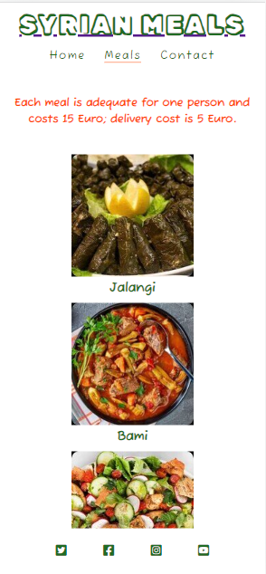

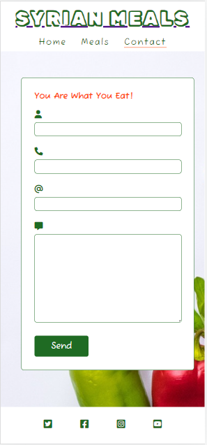

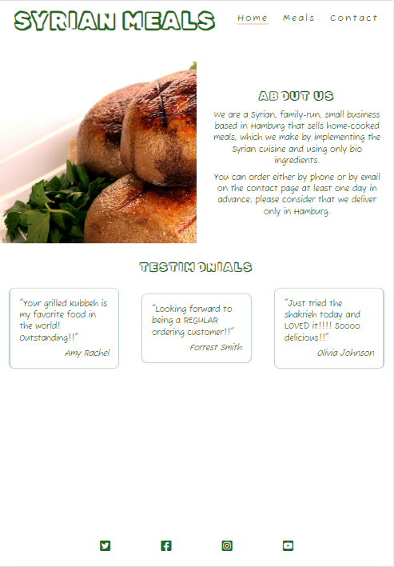

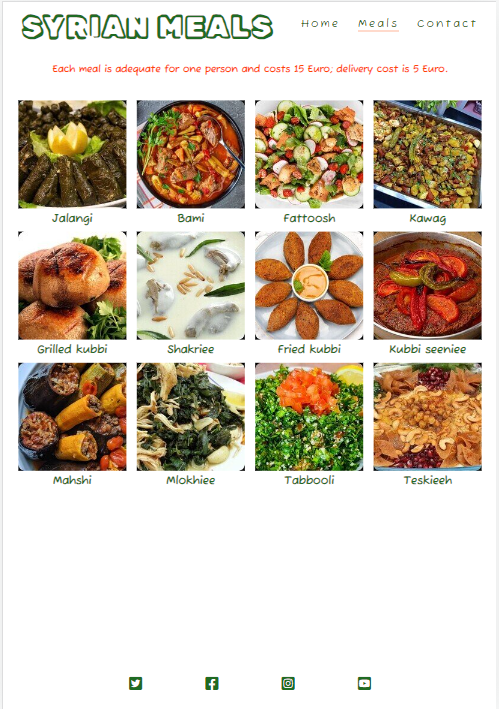

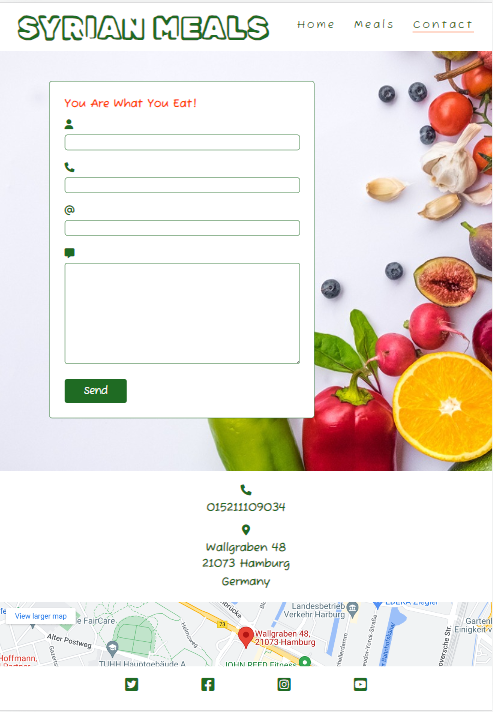

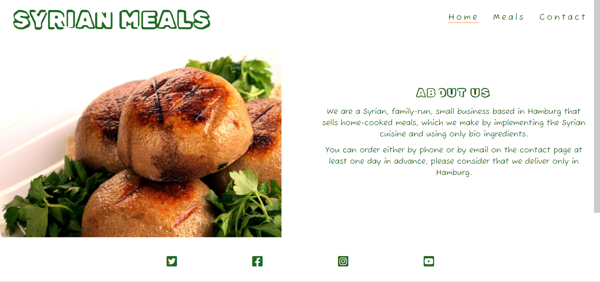

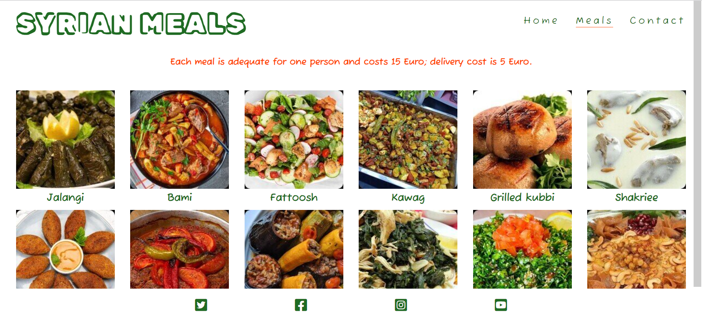

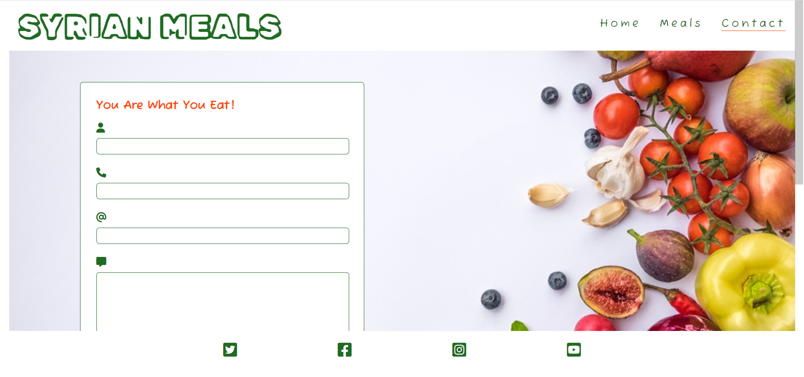

# Deployment
  + Via Gitpod
  + Via Github

# Credits 
  + Code Institute HTML and CSS tutorials and videos
  + Code Institute Love Running walkthrough project
  + W3Schools HTML and CSS tutorials

    
    

    
