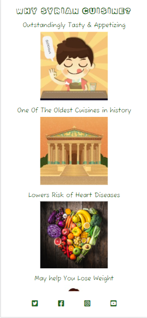

# Syrian Meals

# Table of Contents

- [Syrian Meals](#syrian-meals)
- [1. User stories](#1-user-stories)
  * [1. 1. Home pape](#1-1-home-pape)
  * [1. 2. Meals page](#1-2-meals-page)
  * [1. 3. Contact page](#1-3-contact-page)
- [2. Existing Features](#2-existing-features)
  * [2. 1. Navigation bar](#2-1-navigation-bar)
  * [2. 2. The landing page image](#2-2-the-landing-page-image)
  * [2. 3."About Us" section](#2-3about-us-section)
  * [2. 4. "Why Syrian cuisine" section](#2-4-why-syrian-cuisine-section)
  * [2. 5. "Testimonials" section ](#2-5-testimonials-section)
  * [2. 6. The footer](#2-6-the-footer)
  * [2. 7. The "Meals" section](#2-7-the-meals-section)
  * [2. 8. The contact form](#2-8-the-contact-form)
  * [2. 9. Phone and address section](#2-9-phone-and-address-section)
  * [2. 10. Syrian Meals address on Google Maps](#2-10-syrian-meals-address-on-google-maps)
  * [2. 11. Confirmation page](#2-11-confirmation-page)
- [3. Future Features](#3-future-features)
- [4. Typography and color scheme](#4-typography-and-color-scheme)
- [5. Wireframes](#5-wireframes)
- [6. Technology](#6-technology)
  * [6. 1. HTML](#6-1-html)
  * [6. 2. CSS ](#6-2-css)
  * [6. 3. Gitpod](#6-3-gitpod)
  * [6. 4. GitHub](#6-4-github)
  * [6. 5. Balsamiq](#6-5-balsamiq)
  * [6. 6. Google Fonts](#6-6-google-fonts)
  * [6. 7. Font Awesome](#6-7-font-awesome)
  * [6. 8. W3C HTML and CSS validator](#6-8-w3c-html-and-css-validator)
- [7. Code validation](#7-code-validation)
  * [7. 1. index.html file](#7-1-indexhtml-file)
  * [7. 2. meals.html file](#7-2-mealshtml-file)
  * [7. 3. contact.html file](#7-3-contacthtml-file)
  * [7. 4. style.css file](#7-4-stylecss-file)
  * [7. 5. Lighthouse report](#7-5-lighthouse-report)
- [8. Test cases](#8-test-cases)
  * [8. 1. Testing the website's logo](#8-1-testing-the-websites-logo)
  * [8. 2. Testing the "Home" link in the navigation bar](#8-2-testing-the-home-link-in-the-navigation-bar)
  * [8. 3. Testing the "Meals" link in the navigation bar](#8-3-testing-the-meals-link-in-the-navigation-bar)
  * [8. 4. Testing the "Contact" link in the navigation bar](#8-4-testing-the-contact-link-in-the-navigation-bar)
  * [8. 5. Testing the link to the Syrian Meals' Instagram page in the footer](#8-5-testing-the-link-to-the-syrian-meals-instagram-page-in-the-footer)
  * [8. 6. Testing the link to the Syrian Meals' Facebook page in the footer](#8-6-testing-the-link-to-the-syrian-meals-facebook-page-in-the-footer)
  * [8. 7. Testing the link to the Syrian Meals' Twitter page in the footer](#8-7-testing-the-link-to-the-syrian-meals-twitter-page-in-the-footer)
  * [8. 8. Testing the link to the Syrian Meals' YouTube page in the footer](#8-8-testing-the-link-to-the-syrian-meals-youtube-page-in-the-footer)
  * [8. 9. Testing the contact form on the contact page](#8-9-testing-the-contact-form-on-the-contact-page)
  * [8. 10. Testing the Syrian Meals' address location on Google Maps](#8-10-testing-the-syrian-meals-address-location-on-google-maps)
- [9. Fixed bugs](#9-fixed-bugs)
- [10. Supported screens and browsers ](#10-supported-screens-and-browsers)
- [11. Deployment](#11-deployment)
  * [11. 1. Via Gitpod](#11-1-via-gitpod)
  * [11. 2. Via Github](#11-2-via-github)
- [12. Credits ](#12-credits)

# Syrian Meals
+ Syrian Meals is a website for a family-run small business that sells homemade Syrian meals in Hamburg, Germany, which will be sought by people who enjoy eating both quite delicious and quite healthy food. Syrian Meals will be useful to those people as it markets its meals through this site and its links to the relevant social media, which, in turn, makes it feasible for its customers to order their prized meals by phone or email.
+ I developed Syrian Meals as my portfolio project 1 of my full stack software development diploma with the Code Institute in Dublin, Ireland.

# 1. User stories
## 1. 1. Home pape
+ "As a visiting user, I would like to know more about the Syrian Meals small business."

## 1. 2. Meals page
+ "I, as a visiting user, would like to be informed about which dishes Syrian Meals sells."

## 1. 3. Contact page
+ "As a visiting user, I would like to contact Syrian Meals for any business enquiries."

# 2. Existing Features
## 2. 1. Navigation bar
+ The full responsive navigation bar is featured on all three pages and includes links to the logo, home page, meals page, and contact page and is identical on each page to allow for easy navigation. 
+ This section will allow the user to easily navigate from page to page across all devices without having to revert to the previous page via the ‘back’ button.

## 2. 2. The landing page image
+ The landing page image on the top left shows one of the Syrian cuisine trophies "Grilled kubbi" which is so appetizing that a user craves it instantly.
  

## 2. 3."About Us" section
+ This section appears on the top right of the home page and informs a user that "Syrian Meals" is a Syrian, family-run, small business that sells home-cooked, Syrian meals in Hamburg by implementing Syrian cuisine and using only bio ingredients. Those three characteristics emphasize to a user that this small business aims to produce meals of very high quality that is quite healthy and tasty. The fact that the small business is Syrian demonstrates that the meals not only follow the Syrian cuisine meals but also are being made by Syrians, whose nutrition system stands the test of time for thousands of years.
+ The second paragraph explains to a user how he can order a meal; it says that a user can order by phone or email, which are inserted on the contact page, at least one day in advance, which, again, foregrounds that a meal quality is a dominant feature as meals will always be fresh on the day of eating.
+ Furthermore, it has been highlighted that the small business can deliver its meals only in Hamburg.

## 2. 4. "Why Syrian cuisine" section
+ Featuring six points, this section interprets what makes syrian cuisine in a class by itself, which is forecast to p. d. q. close the sale with a user.
+ Syrian cuisine is exceptionally tasty and one of the most ancient cuisines in history known to man.
+ It lowers the risk of heart and brain diseases, supports healthy blood sugar, and may help lose some weight.
+ Please consider its grid image beneath.

## 2. 5. "Testimonials" section 
+ It reveals three positive testimonials written by customers of "Syrian Meals", which adds to the small business's credibility and stimulates a user to buy a meal.

## 2. 6. The footer
+ The footer section contains links to the relevant social media sites for Syrian Meals. The links will open to a new tab to allow easy navigation for the user.
+ Clicking on the Instagram link opens the Syrian Meals page on Instagram in a new tab.
+ Clicking on the Facebook link opens the Syrian Meals page on Facebook in a new tab.
+ Clicking on the Twitter link opens the Syrian Meals page on Twitter in a new tab.
+ Clicking on the YouTube link opens the Syrian Meals page on YouTube in a new tab.
+ The footer is cherished by the user as it inspires them to keep connected via social media.

## 2. 7. The "Meals" section
+ The "Meals" section on the meals page exhibits 12 captivating images of 12 of the Syrian cuisine sensations, each with a relavent, ancient meal name; at this point, a user is expected to order one of the meals as their appetite will be thoroughly activated. The attractive, ancient meal names will arouse a user's curiosity to a greater extent.
+ This includes a small paragraph at the top that describes to a user that each meal is enough for one person, that each meal costs 15 Euros, and that delivery costs 5 Euros. Those details help a user briskly choose which and how many meals they would like.

## 2. 8. The contact form
+ The contact form exists on the contact page and motivates a user to send Syrian Meals a message; in their message, they are free to order, to inquire more about the meals, or to ask anything they want; a user will be requested to submit their name, phone, and email.
+ Underneath the contact form, there is an appealing background image that reflects some vegetables and fruits, which allusively accentuates the fact that eating per a traditional cooking school, like the vintage Syrian one that exclusively employs natural, bio ingredients, is key for anyone who wants to stay strong and healthy.
+ The header of the contact form, "You Are What You Eat!" spotlights to the user what "Syrian Meals" is all about.
+ I targeted each of the 4 icon elements, each of the 3 input field elements, and the textarea element of the contact form with an aria-label attribute that unfolds the purpose of each of them.
+ In addition, I targeted each of the two icons of the Syrian Meals' address with an aria-label that narrates the goal of each of them.

## 2. 9. Phone and address section
+ The small business phone and address are located here, so a user can contact Syrian Meals and order their meals; the address enables a customer to visit Syrian Meals and fetch their meals themselves, in this case, they will not have to pay the 5 Euros delivery costs.

## 2. 10. Syrian Meals address on Google Maps
+ Customers can quickly and precisely locate Syrian Meals as its location on Google Maps is embedded just below the phone and address section at the bottom of the contact page.

## 2. 11. Confirmation page
+ As a user sends a message via the contact form on the contact page, a confirmation page opens in a new tab, in which there is a vindication message that asserts to the user that Syrian Meals has received their message.

# 3. Future Features
+ In the future, Syrian Meals plans to add more Syrian cuisine wonders to its menu.
+ Customers will be able to order their special meal that will be tailored to meet their wishes.
+ An online payment method using, for example, a credit card will be built into the website.

# 4. Typography and color scheme
+ Two fonts from Google fonts have been used: "Fuzzy Bubbles" and "Rubik Vinyl".
+ 9 icons from Font Awesome have been implemented: Facebook, Twitter, Instagram, YouTube, user, phone, email, text, and check.
+ 4 colors have been applied: #1f6b23, #ff4500, #ffffff, and #fafad2.

# 5. Wireframes
+ There are three wireframes, one for each website page.
+ They are going to be displayed here by means of eight wireframes screenshots as follows.

# 6. Technology
## 6. 1. HTML
+ Using HTML, I created the content of the Syrian Meals website, made it accessible, and provided the relevant structure for search engine optimization.
## 6. 2. CSS 
+ I utilized CSS to make the Syrian Meals website content both visually appealing and responsive on different screen sizes of laptops, tabs, and smartphones.
## 6. 3. Gitpod
+ Gitpod is an efficient cloud-based integrated development environment that I employed to write, review, integrate, and deploy the HTML and CSS code of the Syrian Meals website without any need for any installations or configurations.
## 6. 4. GitHub
+ A platform for version control and collaborative software development, which I exploited to create a central code repository for and deploy the Syrian Meals website; this, in turn, allows me to keep track of changes made to code and revert to previous versions if needed.
## 6. 5. Balsamiq
+ This is the program I applied to generate the frameworks of the Syrian Meals website.
## 6. 6. Google Fonts
+ I resorted to Google Fonts to amplify the look of the Syrian Meals website, so I integrated two of its fonts into the website by inserting their links in their respective CSS file.
## 6. 7. Font Awesome
+ To enhance the visual design of the Syrian Meals website, I turned to Font Awesome and incorporated 8 fonts into it.
## 6. 8. W3C HTML and CSS validator
+ W3C validator is an online tool that checks html and css code.
+ A user can validate by URL, file upload, or direct input.
+ Using the W3C validator, I checked the html and css files of the Syrian Meals' website; I utilized two validation methos: by URL and by direct input.

# 7. Code validation
## 7. 1. index.html file
+ Using the W3C html validator, I checked the index.html page; no errors or warnings were found as the following link demonstrates: [Link to validation of index.html file of Syrian Meals ](https://validator.w3.org/nu/?doc=https%3A%2F%2Fmajdi-aref.github.io%2Fsyrian-meals%2Findex.html&showsource=yes&showoutline=yes)
## 7. 2. meals.html file
+ Using the W3C html validator, I checked the meals.html page; no errors or warnings were found as the following link demonstrates: [Link to validation of meals.html file of Syrian Meals ](https://validator.w3.org/nu/?doc=https%3A%2F%2Fmajdi-aref.github.io%2Fsyrian-meals%2Fmeals.html&showsource=yes&showoutline=yes)
## 7. 3. contact.html file
+ Using the W3C html validator, I checked the contact.html page. No errors were found, but three warnings were highlighted. At this point, I prefer to ignore those warnings. Please look at the following link: [Link to validation of contact.html file of Syrian Meals ](https://validator.w3.org/nu/?doc=https%3A%2F%2Fmajdi-aref.github.io%2Fsyrian-meals%2Fcontact.html&showsource=yes&showoutline=yes)
## 7. 4. style.css file
+ Using the W3C CSS validator, I checked the style.css page. No errors were found; however, one warning was recorded. currently, I would ignore this warning. I could test the style.css file only by direct input, thus I took three screenshots of the CSS validation result. Please have a look at the screenshots below.

## 7. 5. Lighthouse report
+ On the authority of Google Lighthouse, the performance of my the home page, meals page, and contact page is 99%, 99%, and 98% respectively. Please have a look at the 3 fitting images further down.

# 8. Test cases
## 8. 1. Testing the website's logo
+ Test description: This test checks the functionality of the website's logo.
+ Steps:
  + Click on the website's logo.
+ Expected Result: The user should be sent back to the website's home page.
+ Actual Result: The user was sent back to the "Home" page.

## 8. 2. Testing the "Home" link in the navigation bar
+ Test description: This test checks the functionality of the "Home" link in the navigation bar.
+ Steps:
  + Click on the "Home" link in the navigation bar.
+ Expected Result: The user should go to website's home page.
+ Actual Result: The user went to the website's home page.

## 8. 3. Testing the "Meals" link in the navigation bar
+ Test description: This test checks the functionality of the "Meals" link in the navigation bar.
+ Steps:
  + Click on the "Meals" link in the navigation bar.
+ Expected Result: The user should go to website's meals page.
+ Actual Result: The user went to the website's meals page.

## 8. 4. Testing the "Contact" link in the navigation bar
+ Test description: This test checks the functionality of the "Contact" link in the navigation bar.
+ Steps:
  + Click on the "Contact" link in the navigation bar.
+ Expected Result: The user should go to website's contact page.
+ Actual Result: The user went to the website's contact page.

## 8. 5. Testing the link to the Syrian Meals' Instagram page in the footer
+ Test description: This test checks the functionality of the link to Syrian Meals' Instagram page in the footer. 
+ Steps:
  + Click on the link to the Syrian Meals' Instagram page in the footer.
+ Expected Result: The Syrian Meals' Instagram page should be opened in a new tab for the user.
+ Actual Result: The Syrian Meals' Instagram page was opened in a new tab for the user.

## 8. 6. Testing the link to the Syrian Meals' Facebook page in the footer
+ Test description: This test checks the functionality of the link to Syrian Meals' Facebook page in the footer. 
+ Steps:
  + Click on the link to the Syrian Meals' Facebook page in the footer.
+ Expected Result: The Syrian Meals' Facebook page should be opened in a new tab for the user.
+ Actual Result: The Syrian Meals' Facebook page was opened in a new tab for the user.

## 8. 7. Testing the link to the Syrian Meals' Twitter page in the footer
+ Test description: This test checks the functionality of the link to Syrian Meals' Twitter page in the footer. 
+ Steps:
  + Click on the link to the Syrian Meals' Twitter page in the footer.
+ Expected Result: The Syrian Meals' Twitter page should be opened in a new tab for the user.
+ Actual Result: The Syrian Meals' Twitter page was opened in a new tab for the user.

## 8. 8. Testing the link to the Syrian Meals' YouTube page in the footer
+ Test description: This test checks the functionality of the link to Syrian Meals' YouTube page in the footer. 
+ Steps:
  + Click on the link to the Syrian Meals' YouTube page in the footer.
+ Expected Result: The Syrian Meals' YouTube page should be opened in a new tab for the user.
+ Actual Result: The Syrian Meals' YouTube page was opened in a new tab for the user.

## 8. 9. Testing the contact form on the contact page
+ Test description: This test checks the functionality of the contact form.
+ Steps:
  + Type your name in the user's name input field.
  + Type your phone number in the phone number's input field.
  + Type your email address in the email address's input field.
  + Type your message in the message's input field.
  + Press "Send."
+ Expected Result: A confirmation message should open in a new tab assuring the user that Syrian Meals has received their message.
+ Actual Result: A confirmation message opened in a new tab assuring the user that Syrian Meals has received their message.
+ Please have a look at the apposite screenshots beneath.

## 8. 10. Testing the Syrian Meals' address location on Google Maps
+ Test description: This test checks the functionality of the Syrian Meals' address location on Google Maps.
+ Steps:
  + Click on the the Syrian Meals' address location on Google Maps.
+ Expected Result: A detailed, big Google map opens in a new tab showing the inch-perfect location of the Syrian Meals' address.
+ Actual Result: A detailed, big Google map opened in a new tab showing the inch-perfect location of the Syrian Meals' address.
+ Please inspect the image below.

# 9. Fixed bugs
+ There was solely one bug that appeared as interrupted underlines underneath the Syrian Meals logo; oddly, it appeared only on smartphone screen sizes. 
+ I created a class for the anchor element of the logo in all html files and targeted it in the style.css with a "text-decoration" property, then I furnished it with a value of "none". Once I did that, the bug retired!
+ Please look at the proper images below, the first image as the logo was bugged and the second one after I have debugged it.

# 10. Supported screens and browsers 
+ Appling multiple media queries, I developed the Syrian Meals' website to fit Laptops', tabs', and smartphones' screen sizes. 
+ The browser that I plied the most is Google Chrome; sometimes I exercised Microsoft Edge.
+ Please have a look a the images below; they successively show how the website's pages simulate on smartphones, tabs, and laptops.

# 11. Deployment
## 11. 1. Via Gitpod
+ Gitpod is a cloud-based development environment that allows you to develop, build, and deploy your website in the cloud.
+ Open an account and create a new repository on Github.
+ Open Gitpod' dashboard, then create a new workspace for the new repository that you created on Github; Gitpod will save the workspace that you created.
+ Open the Gitpod's workspace that you just created.
+ As soon as you have opened your repository in Gitpod, you can use the terminal to run the necessary commands to build and deploy your website.
+ Using the terminal, create as many html and css files as you need for your project.
+ Using the terminal, create a readme.md file for your project.
+ Type in the Gitpod's terminal the command: "python3 -m http.server", a small window opens at the right bottom corner.
+ In that small window, click on "Open browser"; this opens your Github's repository through your Gitpod's workspace in a browser in a new tab.
+ Press at that same time "Control + Shift + R" to refresh your browser.
+ Press at the same time "Control + S" to save the code you create in Gitpod's worksace; this will automatically save it in your applicable file in your Gitpod's workspace.
+ Type in the Gitpod's terminal the command: "git add ." to add your project's code that you have created during a working session of yours to your Gitpod's workspace.
+ Type in the Gitpod's terminal the command: "git commit -m "what code or styling you have created in your Gitpod's workspace in just a few words" to commit your project's code to your Gitpod's workspace.
+ Type in the Gitpod's terminal the command: "git push" to push and save your project's code in your Github's repository.
## 11. 2. Via Github
+ GitHub is a free code hosting platform for version control and collaboration. It lets you and others work together on projects from anywhere.
+ Open Github and sign in.
+ Using the menu on the top right corner, click on "Your repositories".
+ Click on the repository that you want to open.
+ On your repository page, click on "Settings".
+ On the settings' page, click on "Pages".
+ In Github pages under "Source" under "Build and deploy", choose "Deploy from a branch".
+ In Github pages under "branch", choose the option "main" and then click on "Save".
+ Typically within few minutes, your repository will be deployed; a public URL link of your repository will emerge on top of Github pages.
+ Click on the public URL link to open the new website of your repository live in a browser!

# 12. Credits 
  + Code Institute HTML and CSS tutorials and videos
  + Code Institute Love Running walkthrough project
  + W3Schools HTML and CSS tutorials
  